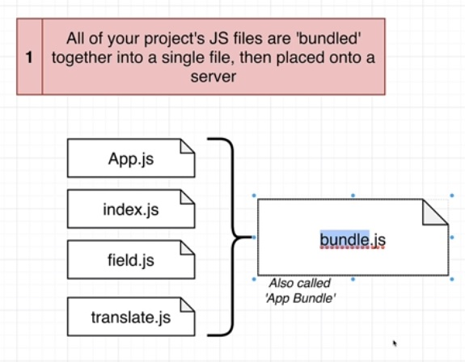

# React + Vite

## Ejercicio numero 1 del curso de udemy de react de Stephen Grider.

This template provides a minimal setup to get React working in Vite with HMR and some ESLint rules.

Currently, two official plugins are available:

- [@vitejs/plugin-react](https://github.com/vitejs/vite-plugin-react/blob/main/packages/plugin-react/README.md) uses [Babel](https://babeljs.io/) for Fast Refresh
- [@vitejs/plugin-react-swc](https://github.com/vitejs/vite-plugin-react-swc) uses [SWC](https://swc.rs/) for Fast Refresh

## Temas que se cubren

## Tips

- Por medio de esta pequeña app se demuestra como funciona jsx y las 5 reglas primarias a comparacion de HTML normal.
- Tambien se explica como react captura el root del dom para renderizarlo
- Curiosamente un input se puede editar en vivo sin necesidad de utilizar el (e)
- Porfavor aplicar al menos las 5 reglas basicas de HTML.
- Ojo con los numeros y letras y en donde deja pasar objects y en donde no a travez de los curlyes

## Diagramas utilizados

001-Bundle
: Explica que react transforma todo los js en un solo bundle que manda al browser

002-de js a html
: Simple explicacion de como por medio de js se estrae el root y se renderiza con la funcion render de react.

003-que es useState

004-all the files that are inside a react template basic

005-pequeño ejemplo de como bable pasa info

